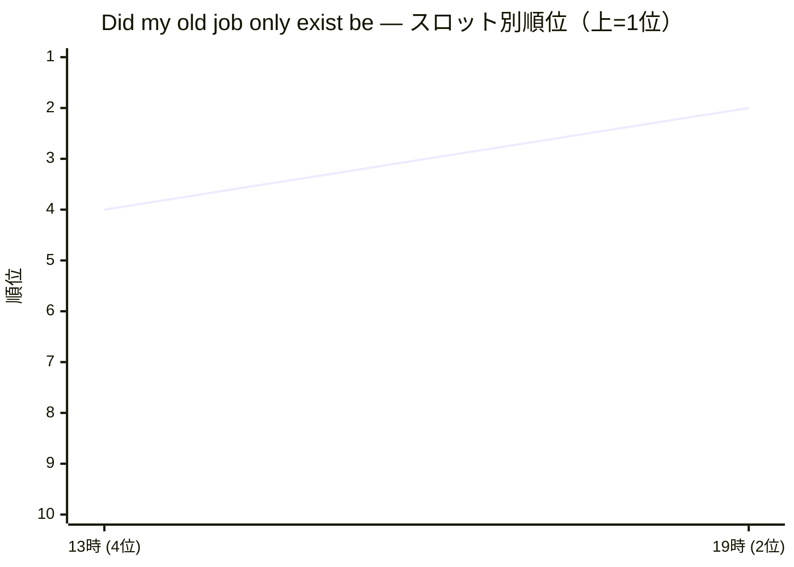

# 日次サマリー — 2026-06-22（JST）
- **対象（観測日）**: 2026年6月22日
- **生成・送信完了**: 自動生成（時刻未入力）

## 今日の一行結論

「国旗国歌法から27年 当時の法制局長官は国旗損壊罪「絶対反対」」が19時1位に上昇し、「大谷翔平」も注目されています。

## 📈 昨日いちばん動いた3つ

1. [国旗国歌法から27年 当時の法制局長官は国旗損壊罪「絶対反対」](https://www.asahi.com/articles/ASV6K3QJFV6KUTIL00ZM.html)（World News）

> jump **+10.0** · ニュース

   - **補足**: 13時に1位に上昇し、19時もその位置を維持しました。

| | 07 | 13 | 19 |
|:--:|:-:|:-:|:-:|
| 順位 | — | 1 | 1 |

2. [大谷翔平](https://ja.wikipedia.org/wiki/%E5%A4%A7%E8%B0%B7%E7%BF%94%E5%B9%B3)（Wikipedia）

> jump **+10.0** · 検索・動画

   - **補足**: 13時に1位に上昇し、19時もその位置を維持しました。

| | 07 | 13 | 19 |
|:--:|:-:|:-:|:-:|
| 順位 | — | 1 | 1 |

3. [Did my old job only exist because of fraud?](https://david.newgas.net/did-my-old-job-only-exist-because-of-fraud/)（Hacker News (US)）

> jump **+9.0** · テック・開発

| | 07 | 13 | 19 |
|:--:|:-:|:-:|:-:|
| 順位 | — | 4 | 2 |

## 複数ソースで重なった話題 — 2026-06-22

複数のソースで重なったトピックがいくつかあります。

### 1. andy burnham

異なる取得元で同じ話題が観測されました。
- **登場ソース**: Google Trends (US), Wikipedia (EN)

| | 07 | 13 | 19 |
|:--:|:-:|:-:|:-:|
| 順位 | — | — | 6 |

### 2. Toy Story 5

異なる取得元で同じ話題が観測されました。
- **登場ソース**: 映画 (US), Wikipedia (EN)

| | 07 | 13 | 19 |
|:--:|:-:|:-:|:-:|
| 順位 | 4 | 4 | 4 |

## 📊 カテゴリ別トップ3

### ニュース
**今日の傾向**: 国旗国歌法に関する議論が再燃しています。

1. [国旗国歌法から27年 当時の法制局長官は国旗損壊罪「絶対反対」](https://www.asahi.com/articles/ASV6K3QJFV6KUTIL00ZM.html)（World News · 7時圏外 → 13時1位 → 19時1位）
2. [英 スターマー首相が辞意を表明 党内から辞任求める声強まる](http://www3.nhk.or.jp/news/html/20260622/k10015156341000.html)（NHK · 7時圏外 → 13時圏外 → 19時1位）
3. [ブリオーニ、2027年春夏メンズコレクションをミラノで祝福](https://prtimes.jp/main/html/rd/p/000000064.000094238.html)（PR TIMES × はてブ · 7時圏外 → 13時圏外 → 19時1位）

### 検索・動画
**今日の傾向**: 大谷翔平に関する検索が増加しています。

1. [大谷翔平](https://ja.wikipedia.org/wiki/%E5%A4%A7%E8%B0%B7%E7%BF%94%E5%B9%B3)（Wikipedia · 7時圏外 → 13時1位 → 19時1位）
2. [平良海馬](https://www.google.com/search?q=%E5%B9%B3%E8%89%AF%E6%B5%B7%E9%A6%AC)（Google Trends · 7時圏外 → 13時圏外 → 19時1位）
3. [中傷動画対応で業務時間確保できずと首相](https://www.google.com/search?q=%E4%B8%AD%E5%82%B7%E5%8B%95%E7%94%BB%E5%AF%BE%E5%BF%9C%E3%81%A7%E6%A5%AD%E5%8B%99%E6%99%82%E9%96%93%E7%A2%BA%E4%BF%9D%E3%81%A7%E3%81%8D%E3%81%9A%E3%81%A8%E9%A6%96%E7%9B%B8)（はてな · 7時圏外 → 13時圏外 → 19時1位）

### テック・開発
1. [自作 macOS IME「RomKana」開発記](https://zenn.dev/toshinao/articles/1cffb713b1c670)（Zenn · 7時圏外 → 13時圏外 → 19時1位）
2. [Did my old job only exist because of fraud?](https://david.newgas.net/did-my-old-job-only-exist-because-of-fraud/)（Hacker News (US) · 7時圏外 → 13時4位 → 19時2位）
3. [What's in my bag？ | 化学系開発マーケティング職の通勤カバン](https://note.com/stationary_log/n/n7cb19d91c2bf)（note · 7時圏外 → 13時圏外 → 19時2位）

### マーケット
1. [HBO Max: Stream Movies & TV](https://apps.apple.com/us/app/hbo-max-stream-movies-tv/id1666653815?uo=2)（App Store (US) · 7時圏外 → 13時圏外 → 19時1位）
2. [Equinox Gold Publishes 2025 Sustainability Report](https://www.globenewswire.com/news-release/2026/06/22/3315112/0/en/Equinox-Gold-Publishes-2025-Sustainability-Report.html)（GlobeNewswire (US) · 7時圏外 → 13時圏外 → 19時1位）
3. [Vinted: Pre-loved marketplace](https://apps.apple.com/us/app/vinted-pre-loved-marketplace/id632064380?uo=2)（App Store (US) · 7時圏外 → 13時圏外 → 19時4位）

### エンタメ
1. [スター・ウォーズ／マンダロリアン・アンド・グローグー](https://www.google.com/search?q=%E3%82%B9%E3%82%BF%E3%83%BC%E3%83%BB%E3%82%A6%E3%82%A9%E3%83%BC%E3%82%BA%EF%BC%8F%E3%83%9E%E3%83%B3%E3%83%80%E3%83%AD%E3%83%AA%E3%82%A2%E3%83%B3%E3%83%BB%E3%82%A2%E3%83%B3%E3%83%89%E3%83%BB%E3%82%B0%E3%83%AD%E3%83%BC%E3%82%B0%E3%83%BC)（映画 · 7時7位 → 13時5位 → 19時5位）
2. [The Mandalorian and Grogu](https://www.google.com/search?q=The+Mandalorian+and+Grogu)（映画 (US) · 7時7位 → 13時5位 → 19時5位）
3. [クスッとわらってサクッとつかえる 小学生の慣用句](https://www.google.com/search?q=%E3%82%AF%E3%82%B9%E3%83%83%E3%81%A8%E3%82%8F%E3%82%89%E3%81%A3%E3%81%A6%E3%82%B5%E3%82%AF%E3%83%83%E3%81%A8%E3%81%A4%E3%81%8B%E3%81%88%E3%82%8B+%E5%B0%8F%E5%AD%A6%E7%94%9F%E3%81%AE%E6%85%A3%E7%94%A8%E5%8F%A5)（楽天ブックス · 7時圏外 → 13時圏外 → 19時9位）